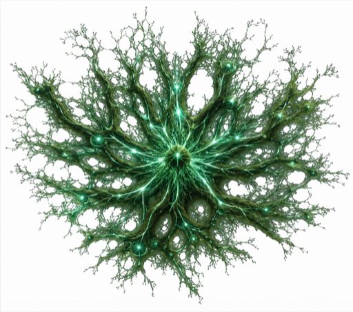

<div align="center">



# mycelium

**The substrate Solana programs grow on.**

A systems-oriented Solana program framework in Zig.
Visibility over convenience. Comptime over runtime.

[](https://ziglang.org)
[](https://solana.com)
[](https://github.com/blueshift-gg/sbpf-linker)
[](./LICENSE)
[](https://github.com/srivtx/mycelium/releases)
[](./docs/EXAMPLES.md)

[Quickstart](./docs/QUICKSTART.md) · [Architecture](./docs/ARCHITECTURE.md) · [Benchmarks](./docs/BENCHMARKS.md) · [CLI](./docs/CLI.md) · [Examples](./docs/EXAMPLES.md)

</div>

---

Programs are written against a ~1900-line comptime substrate that knows
the SBPFv3 ABI and stays out of the way at runtime. No proc macros, no
derive expansions, no hidden validation. The generated SBPF is
byte-identical to what you would have written by hand.

- **2–5× fewer CU than Anchor 1.0**, **9× smaller** on chain
- A complete PDA vault — state, three instructions, every edge case — is **62 lines** of Zig
- `mycelium new my_program` scaffolds a deployable program in under 30 seconds

## Install

```sh
brew install zig llvm@21
cargo install sbpf-linker

git clone https://github.com/srivtx/mycelium
cd mycelium && zig build test
```

Full setup (LLVM symlinks, validator, etc.) in [QUICKSTART.md](./docs/QUICKSTART.md).

## A handler

```zig
const mycelium = @import("mycelium");
const accs = mycelium.accounts;
const fw   = mycelium.framework;

fn initialize(ctx: mycelium.Ctx, p: *const Init) !void {
    const a = try accs.unpack(ctx, .{ .authority = accs.sw, .vault = accs.w, .sys = accs.sys });
    const s = try fw.createPdaState(State, .{
        .payer = a.authority, .pda = a.vault, .system_program = a.sys,
        .program_id = ctx.program_id,
        .seeds = &.{ SEED, &a.authority.key().bytes },
        .bump = p.bump, .rent_lamports = p.rent,
    });
    s.authority = a.authority.key().*;
    s.bump = p.bump;
    s.initialized = 1;
}
```

[See the full vault → 62 lines](./examples/vault_v3/src/main.zig). For the
manual-vs-recipe-layer comparison, see [EXAMPLES.md](./docs/EXAMPLES.md).

## Numbers

Same vault, four implementations, on Agave 3.1:

|              | Anchor | mycelium v3 | Anchor / mycelium |
|--------------|-------:|------------:|------------------:|
| initialize   |  9 497 |   **3 949** |          **2.40×** |
| deposit      |  5 504 |   **2 034** |          **2.71×** |
| withdraw     |  4 053 |     **766** |          **5.29×** |
| binary size  | 153 KB |    **17 KB** |          **9.2×**  |

Full 4-way table (Anchor / v1 / v2 / v3) and escrow numbers in
[BENCHMARKS.md](./docs/BENCHMARKS.md).

## Status

Working end-to-end on a local validator with PDA + CPI, a vault, an
escrow, and a `mycelium` CLI. Ten example programs build and execute;
43 host-side tests pass. Research-grade — do not deploy to mainnet
without an audit.

## License

[MIT](./LICENSE)
